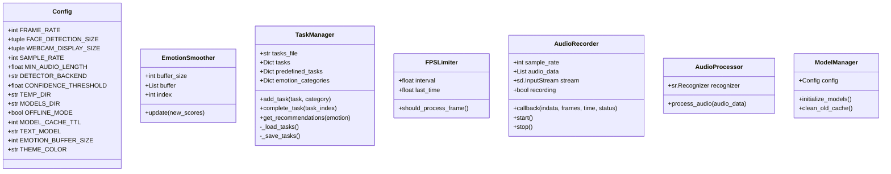
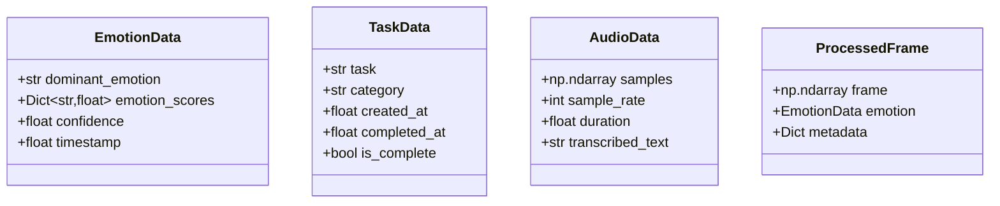
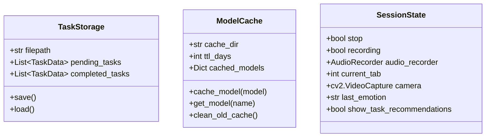
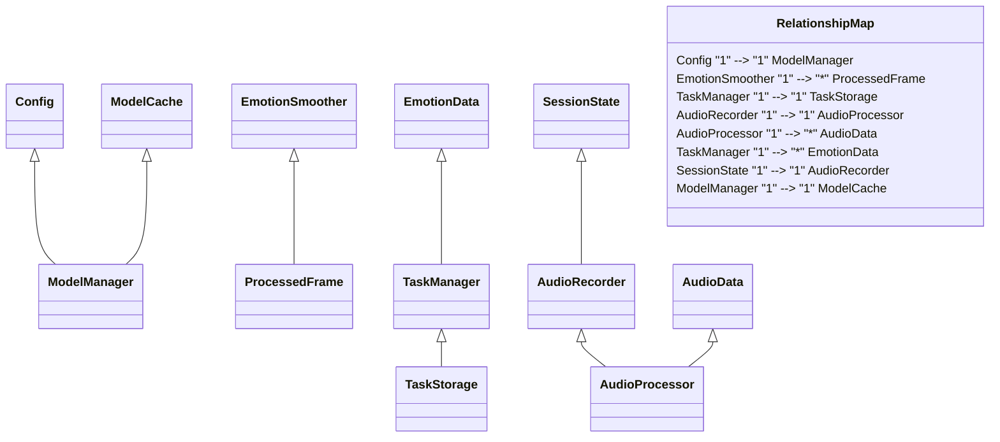

# EmotiSense AI - Data Structures

## Core Data Structures



## Data Flow Types



## Storage Structures



## Relationships



## Type Definitions

```typescript
// Key Type Definitions

type EmotionScores = {
    happy: number;
    sad: number;
    angry: number;
    fear: number;
    neutral: number;
    surprise: number;
    disgust: number;
}

type TaskCategory = "Work" | "Personal" | "Health" | "Learning" | "Other";

type ModelType = "face" | "text" | "voice";

type ProcessingStatus = {
    success: boolean;
    error?: string;
    duration: number;
    timestamp: number;
}
```
