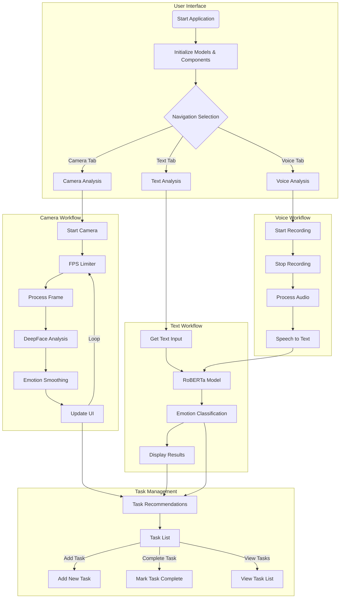
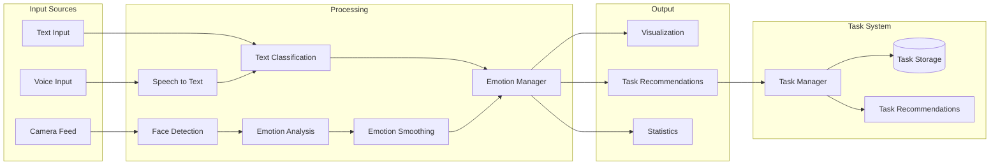
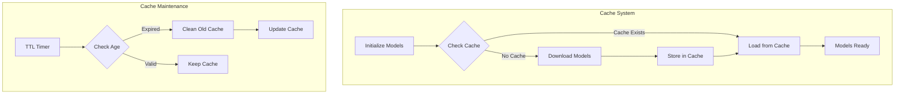
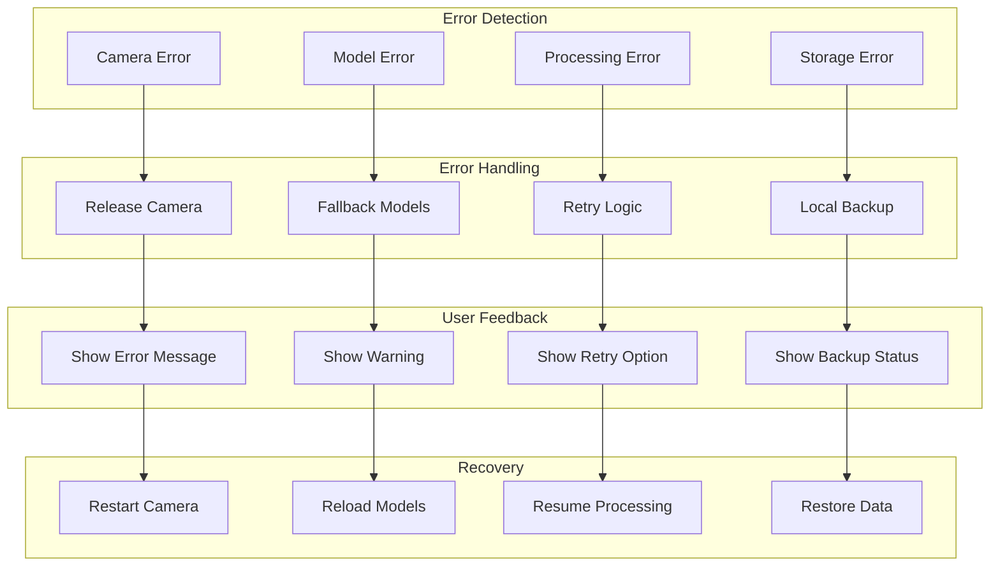

# EmotiSense AI - Workflow Diagrams

## Main Application Flow

```mermaid
graph TB
    subgraph User Interface
        Start(Start Application) --> Init[Initialize Models & Components]
        Init --> Nav{Navigation Selection}
        Nav -->|Camera Tab| Camera
        Nav -->|Text Tab| Text
        Nav -->|Voice Tab| Voice
    end

    subgraph Camera Workflow
        Camera[Camera Analysis] --> StartCam[Start Camera]
        StartCam --> FPS[FPS Limiter]
        FPS --> Frame[Process Frame]
        Frame --> FaceDetect[DeepFace Analysis]
        FaceDetect --> EmotionSmooth[Emotion Smoothing]
        EmotionSmooth --> UpdateUI[Update UI]
        UpdateUI --> |Loop| FPS
    end

    subgraph Text Workflow
        Text[Text Analysis] --> InputText[Get Text Input]
        InputText --> TextModel[RoBERTa Model]
        TextModel --> TextEmotion[Emotion Classification]
        TextEmotion --> DisplayText[Display Results]
    end

    subgraph Voice Workflow
        Voice[Voice Analysis] --> Record[Start Recording]
        Record --> StopRec[Stop Recording]
        StopRec --> Process[Process Audio]
        Process --> STT[Speech to Text]
        STT --> TextModel
    end

    subgraph Task Management
        UpdateUI --> TaskRec[Task Recommendations]
        DisplayText --> TaskRec
        TextEmotion --> TaskRec
        TaskRec --> TaskList[Task List]
        TaskList --> |Add Task| AddTask[Add New Task]
        TaskList --> |Complete Task| CompleteTask[Mark Task Complete]
        TaskList --> |View Tasks| ViewTasks[View Task List]
    end
```

## Emotion Processing Pipeline

```mermaid
graph LR
    subgraph Input Sources
        C[Camera Feed]
        T[Text Input]
        V[Voice Input]
    end

    subgraph Processing
        C --> FD[Face Detection]
        FD --> EA[Emotion Analysis]
        T --> TC[Text Classification]
        V --> STT[Speech to Text]
        STT --> TC
        EA --> ES[Emotion Smoothing]
        TC --> EMO[Emotion Manager]
        ES --> EMO
    end

    subgraph Output
        EMO --> VIS[Visualization]
        EMO --> REC[Task Recommendations]
        EMO --> STAT[Statistics]
    end

    subgraph Task System
        REC --> TM[Task Manager]
        TM --> TS[(Task Storage)]
        TM --> TR[Task Recommendations]
    end
```

## Model Cache Management

```mermaid
graph TB
    subgraph Cache System
        Init[Initialize Models] --> Check{Check Cache}
        Check -->|Cache Exists| Load[Load from Cache]
        Check -->|No Cache| Download[Download Models]
        Download --> Store[Store in Cache]
        Store --> Load
        Load --> Ready[Models Ready]
    end

    subgraph Cache Maintenance
        Timer[TTL Timer] --> CheckAge{Check Age}
        CheckAge -->|Expired| Clean[Clean Old Cache]
        CheckAge -->|Valid| Keep[Keep Cache]
        Clean --> Update[Update Cache]
    end
```

## Error Handling Flow

```mermaid
graph TD
    subgraph Error Detection
        E1[Camera Error]
        E2[Model Error]
        E3[Processing Error]
        E4[Storage Error]
    end

    subgraph Error Handling
        E1 --> H1[Release Camera]
        E2 --> H2[Fallback Models]
        E3 --> H3[Retry Logic]
        E4 --> H4[Local Backup]
    end

    subgraph User Feedback
        H1 --> U1[Show Error Message]
        H2 --> U2[Show Warning]
        H3 --> U3[Show Retry Option]
        H4 --> U4[Show Backup Status]
    end

    subgraph Recovery
        U1 --> R1[Restart Camera]
        U2 --> R2[Reload Models]
        U3 --> R3[Resume Processing]
        U4 --> R4[Restore Data]
    end
```
