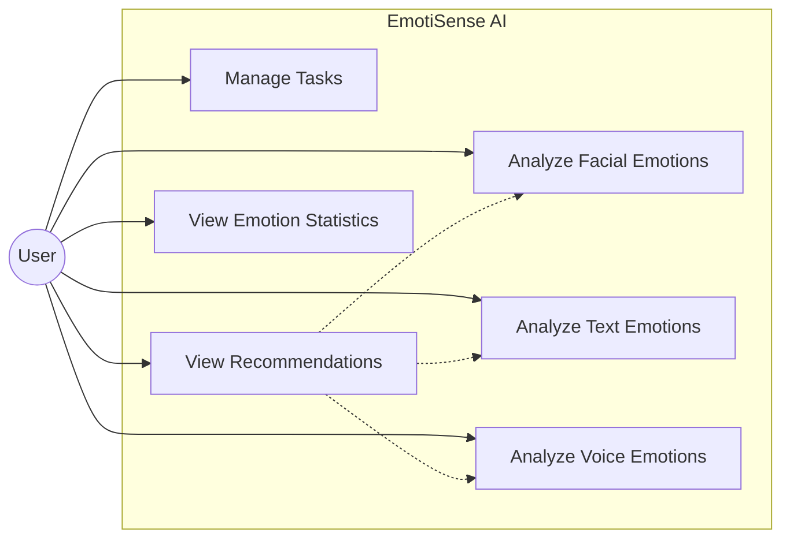
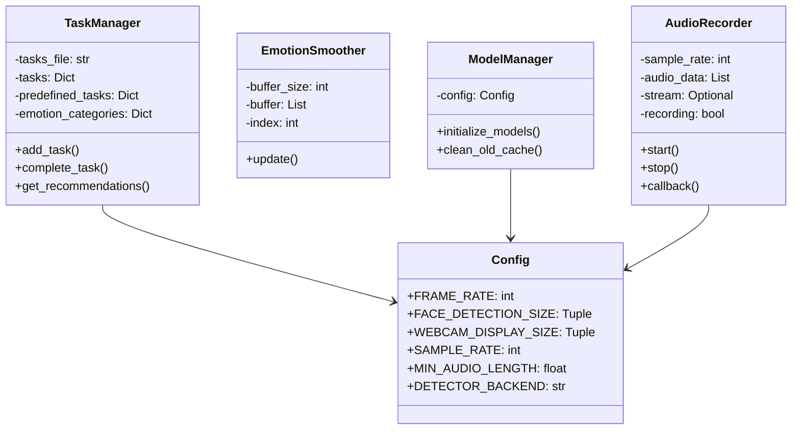
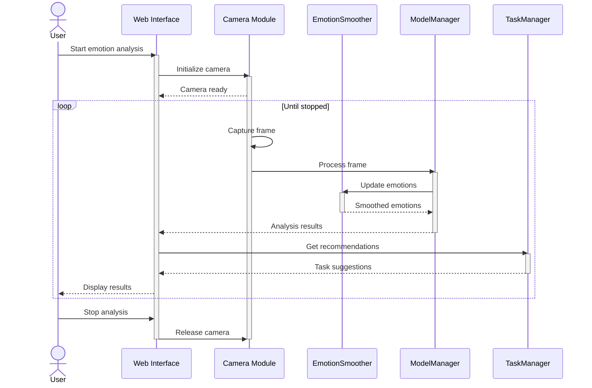
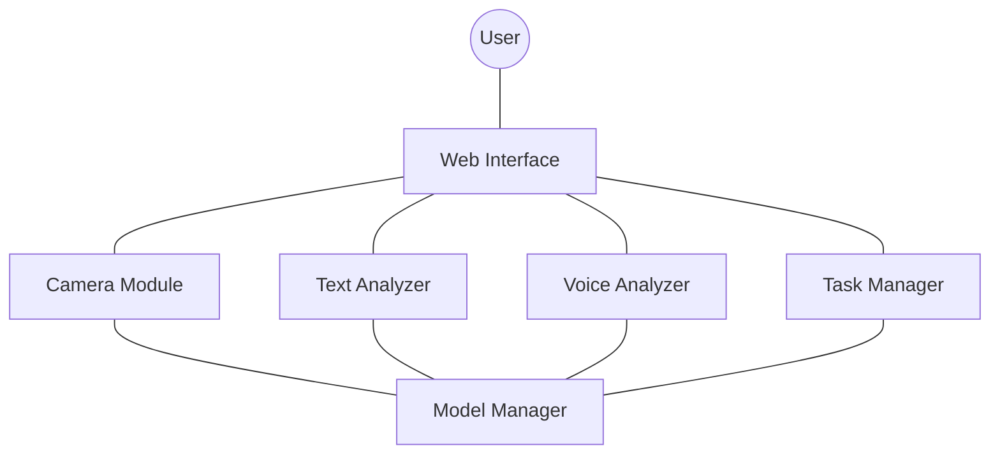
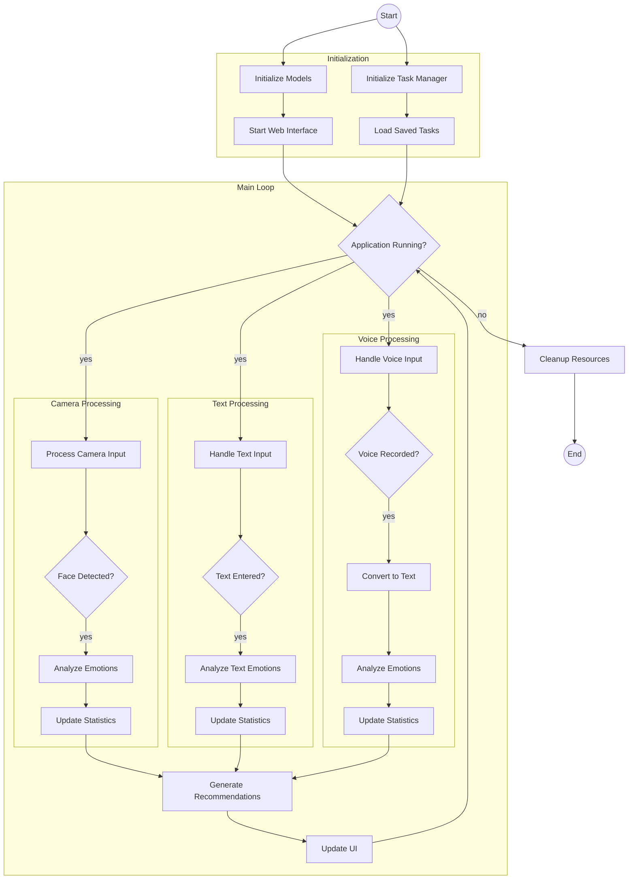
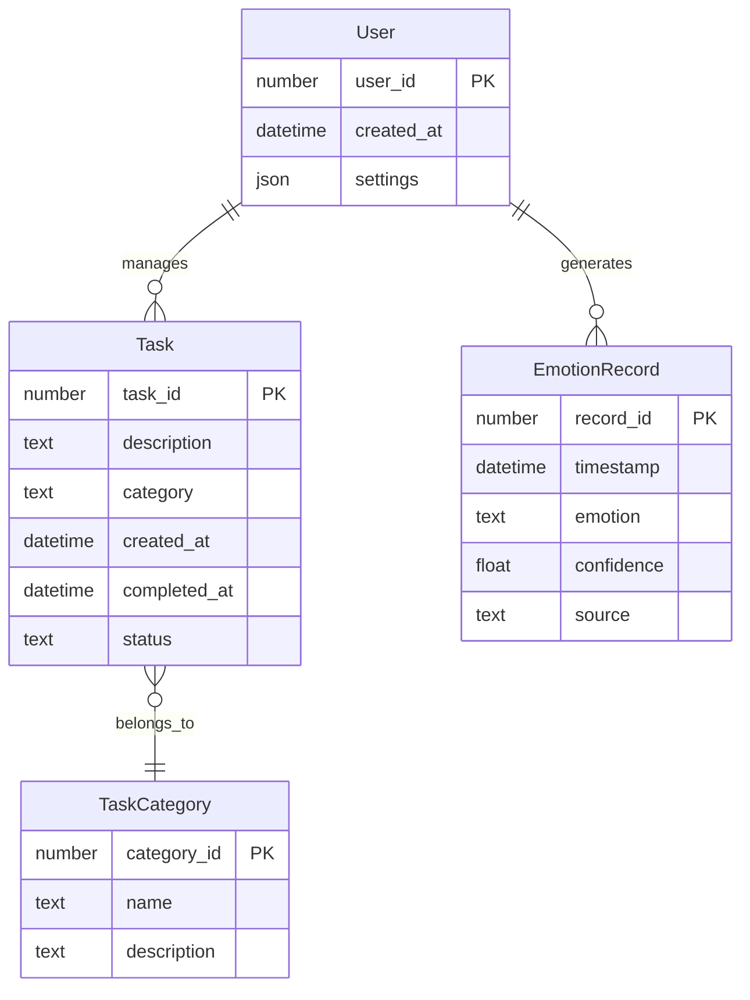

# EmotiSense AI - System Diagrams

## Use Case Diagram


## Class Diagram


## Sequence Diagram


## Collaboration Diagram


## Deployment Diagram
```mermaid
graph TB
    subgraph User Device
        Browser
        Webcam
        Microphone
    end

    subgraph Application Server
        subgraph Streamlit Server
            App[EmotiSense AI Application]
            MM[Model Manager]
            TM[Task Manager]
        end
        
        subgraph File System
            MC[Model Cache]
            TS[Task Storage]
        end
    end

    Browser -->|HTTPS| Streamlit Server
    Webcam -->|USB/Built-in| Browser
    Microphone -->|USB/Built-in| Browser
    MM -->|reads/writes| MC
    TM -->|reads/writes| TS
```

## Activity Diagram


## Entity-Relationship Diagram

