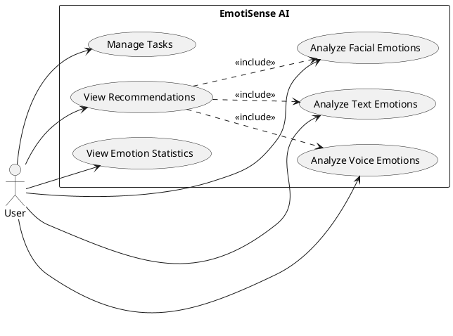
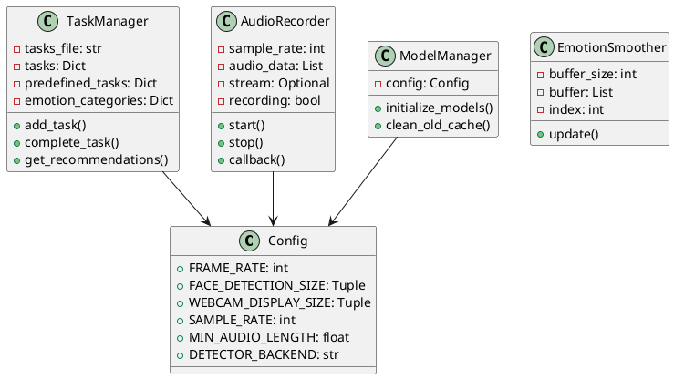
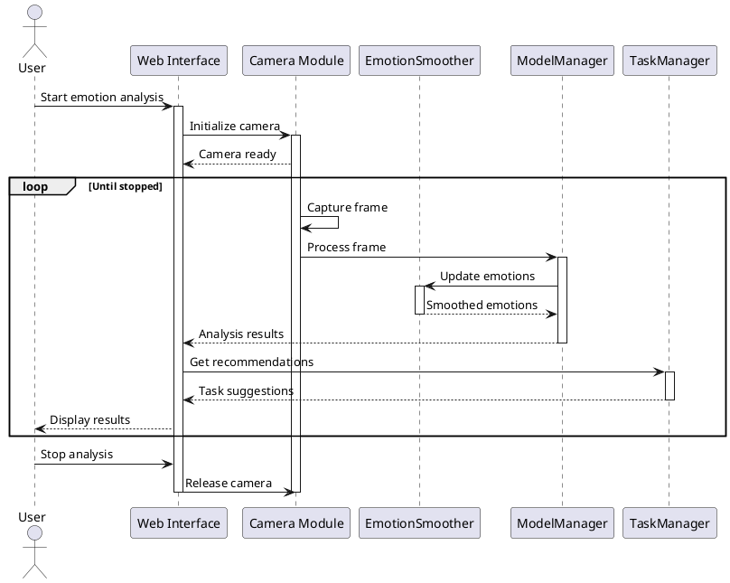
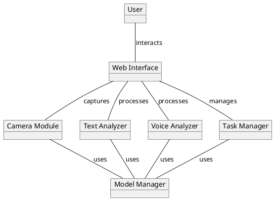
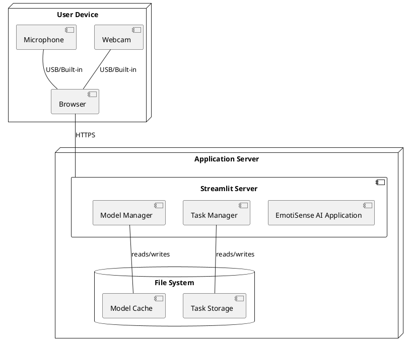
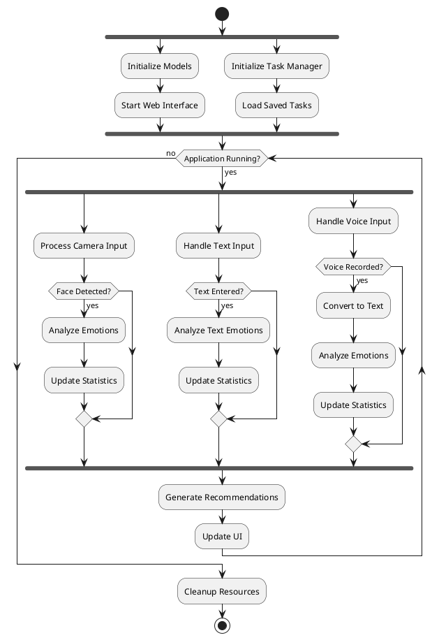
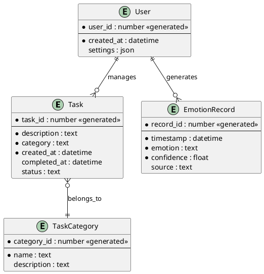

# EmotiSense AI - System Diagrams

## Use Case Diagram

## Class Diagram

## Sequence Diagram

## Collaboration Diagram

## Deployment Diagram

## Activity Diagram

## Entity-Relationship Diagram

