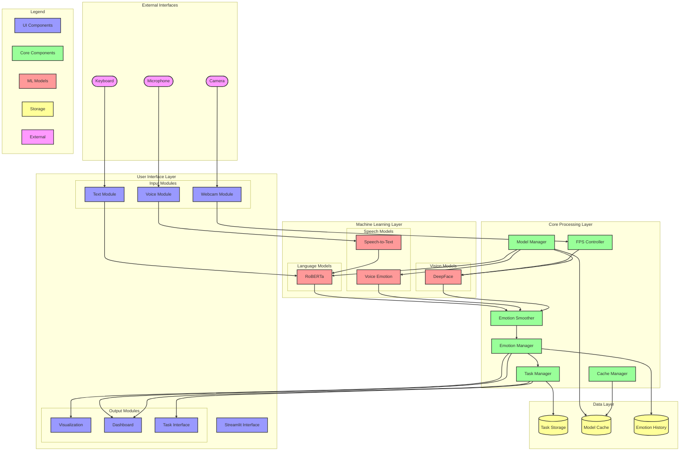

# EmotiSense AI - System Architecture

```mermaid
graph TB
    %% Styling
    classDef external fill:#f9f,stroke:#333,stroke-width:2px
    classDef storage fill:#ff9,stroke:#333,stroke-width:2px
    classDef core fill:#9f9,stroke:#333,stroke-width:2px
    classDef ui fill:#99f,stroke:#333,stroke-width:2px
    classDef ml fill:#f99,stroke:#333,stroke-width:2px

    %% External Components
    subgraph External[External Interfaces]
        Camera([Camera]):::external
        Mic([Microphone]):::external
        KB([Keyboard]):::external
    end

    %% Frontend Layer
    subgraph Frontend[User Interface Layer]
        direction TB
        UI[Streamlit Interface]:::ui
        
        subgraph InputModules[Input Modules]
            WC[Webcam Module]:::ui
            VA[Voice Module]:::ui
            TA[Text Module]:::ui
        end
        
        subgraph OutputModules[Output Modules]
            VIS[Visualization]:::ui
            DASH[Dashboard]:::ui
            TASK[Task Interface]:::ui
        end
    end

    %% Core Processing
    subgraph Core[Core Processing Layer]
        direction LR
        EM[Emotion Manager]:::core
        MM[Model Manager]:::core
        TK[Task Manager]:::core
        ES[Emotion Smoother]:::core
        FPS[FPS Controller]:::core
        CACHE[Cache Manager]:::core
    end

    %% ML Models Layer
    subgraph ML[Machine Learning Layer]
        direction TB
        subgraph Vision[Vision Models]
            FM[DeepFace]:::ml
        end
        
        subgraph Language[Language Models]
            TXT[RoBERTa]:::ml
        end
        
        subgraph Speech[Speech Models]
            STT[Speech-to-Text]:::ml
            VM[Voice Emotion]:::ml
        end
    end

    %% Data Storage
    subgraph Storage[Data Layer]
        TS[(Task Storage)]:::storage
        MC[(Model Cache)]:::storage
        ES_DB[(Emotion History)]:::storage
    end

    %% Connections
    Camera --> WC
    Mic --> VA
    KB --> TA

    WC --> FPS
    VA --> STT
    TA --> TXT

    FPS --> FM
    STT --> TXT
    TXT --> ES
    VM --> ES
    FM --> ES

    ES --> EM
    EM --> TK
    TK --> TASK

    MM --> MC
    MM --> FM
    MM --> TXT
    MM --> VM

    TK --> TS
    EM --> ES_DB
    CACHE --> MC

    EM --> VIS
    EM --> DASH
    TK --> DASH

    %% Data Flow Labels
    linkStyle default stroke-width:2px
    
    %% Add notes
    subgraph Legend
        direction LR
        UI_N[UI Components]:::ui
        CORE_N[Core Components]:::core
        ML_N[ML Models]:::ml
        STORE_N[Storage]:::storage
        EXT_N[External]:::external
    end
```
