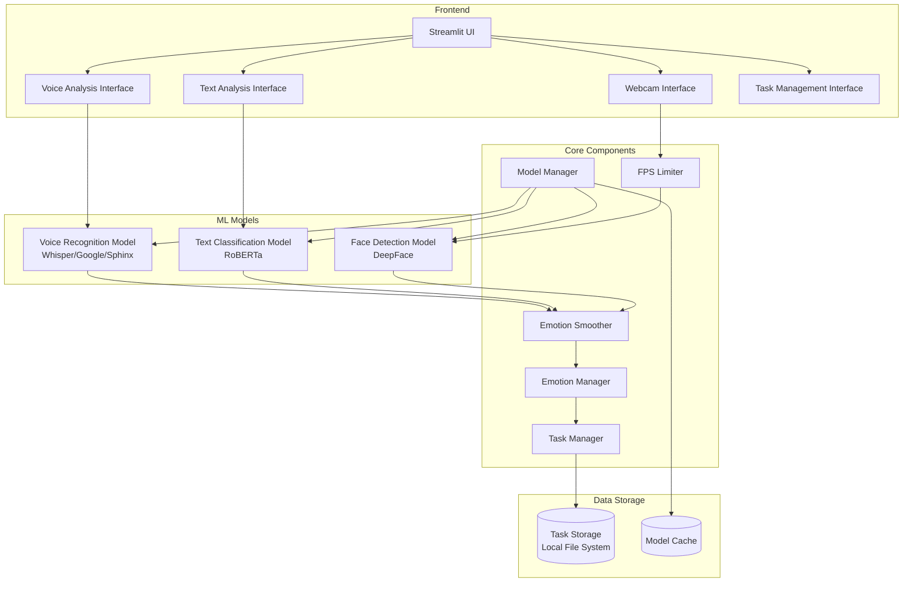

# EmotiSense AI - System Architecture

## Overview
EmotiSense AI is a multi-modal emotion detection system that analyzes emotions through three channels: facial expressions, text, and voice. The system uses machine learning models and provides task recommendations based on detected emotions.

## System Components

## Component Descriptions

### Frontend Layer
- **Streamlit UI**: Main user interface with tabbed navigation
- **Webcam Interface**: Handles camera input and real-time emotion detection
- **Text Analysis Interface**: Processes text input for emotion analysis
- **Voice Analysis Interface**: Manages audio recording and speech-to-text
- **Task Management Interface**: Handles task CRUD operations and recommendations

### Core Components
- **Emotion Manager**: Centralizes emotion detection results from all sources
- **Model Manager**: Handles model initialization, caching, and cleanup
- **Task Manager**: Manages task operations and emotion-based recommendations
- **Emotion Smoother**: Provides temporal smoothing for emotion predictions
- **FPS Limiter**: Controls frame processing rate for webcam analysis

### ML Models
- **Face Detection Model**: Uses DeepFace for facial emotion analysis
- **Text Classification Model**: RoBERTa-based model for text emotion classification
- **Voice Recognition Model**: Multi-backend speech recognition system

### Data Storage
- **Task Storage**: Local file system for storing user tasks
- **Model Cache**: Local storage for ML models and weights

## Data Flow

1. **User Input**
   - Camera feed → FPS Limiter → Face Detection
   - Text input → Text Classification
   - Voice input → Speech Recognition → Text Classification

2. **Processing**
   - Raw predictions → Emotion Smoother
   - Smoothed emotions → Emotion Manager
   - Emotion Manager → Task Manager

3. **Output**
   - Emotion analytics → UI
   - Task recommendations → UI
   - Task updates → Local Storage

## Technical Specifications

- **Framework**: Streamlit
- **Core ML Libraries**: DeepFace, Transformers, SpeechRecognition
- **Data Visualization**: Plotly
- **Configuration**: Dataclass-based configuration system
- **Concurrency**: Async/Await with ThreadPool
- **Cache Management**: TTL-based model caching
- **Error Handling**: Hierarchical exception handling with logging

## Performance Considerations

- Frame rate limiting for optimal performance
- Model caching to reduce load times
- Async processing for non-blocking operations
- Emotion smoothing for stable predictions
- Configurable quality/performance tradeoffs
